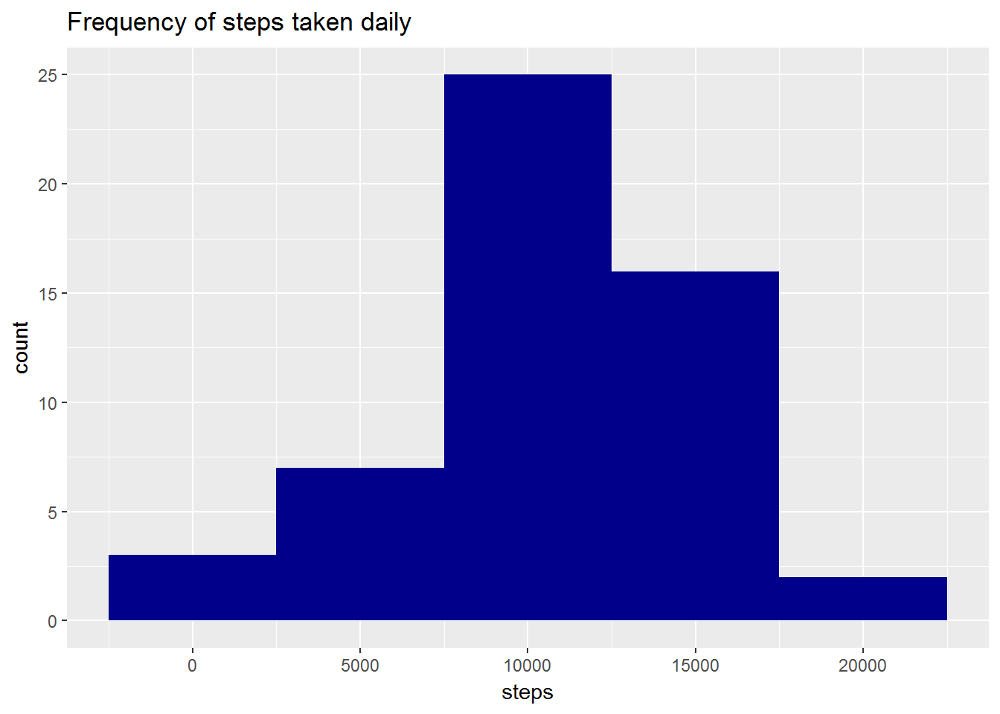
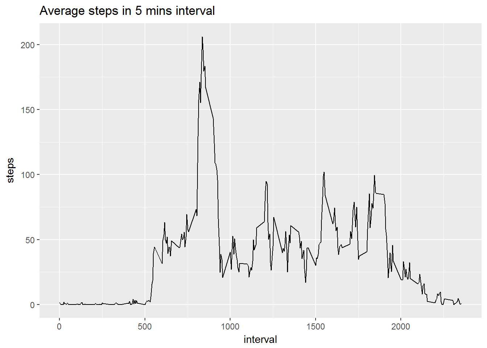
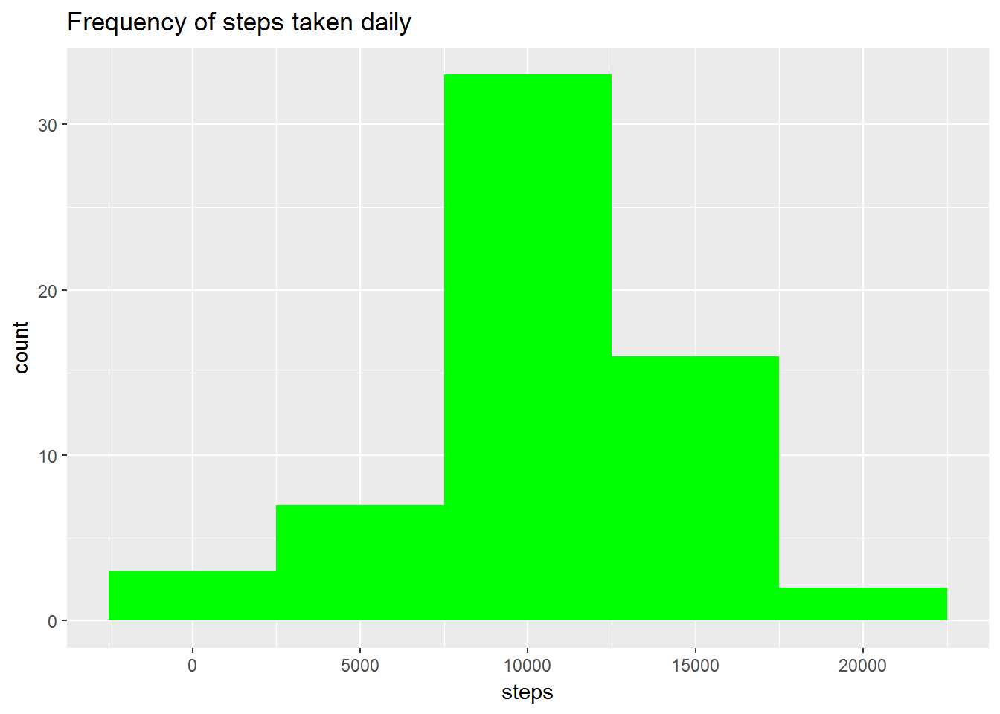
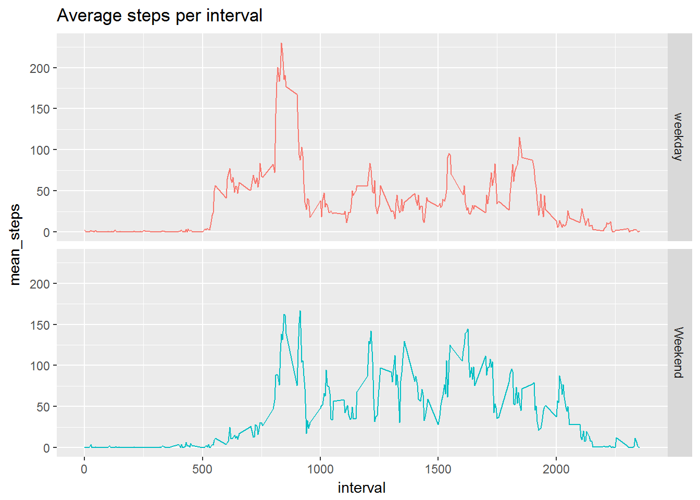

# Reproducible Research - Project 1
FFadel  
July 31, 2017  


###Loading and preprocessing the data  
Show any code that is needed to  
1.    Load the data (i.e. read.csv())  
2.    Process/transform the data (if necessary) into a format suitable for your analysis

```r
# read data
filename <- "./repdata_data_activity/activity.csv"
activity <- read.csv(filename)
```

###What is mean total number of steps taken per day?  
For this part of the assignment, you can ignore the missing values in the dataset.  
1. Calculate the total number of steps taken per day  

```r
#exclude NA data for this part
activity_subset <- activity[!is.na(activity$steps),]
daily_steps <- aggregate(activity_subset[, "steps"], by=list(activity_subset$date), FUN=sum)
names(daily_steps) <- c("date","steps")
```

2. If you do not understand the difference between a histogram and a barplot, research the difference between them. Make a histogram of the total number of steps taken each day  

```r
# Histogram for total steps taken each day
ggplot(daily_steps, aes(steps)) + 
  geom_histogram(binwidth = 5000,fill="darkblue") + 
  ggtitle("Frequency of steps taken daily")
```

<!-- -->

3. Calculate and report the mean and median of the total number of steps taken per day  

```r
cat("Daily steps mean is",ceiling(mean(daily_steps$steps)))
```

```
## Daily steps mean is 10767
```

```r
cat("Daily steps median is",median(daily_steps$steps))
```

```
## Daily steps median is 10765
```
###What is the average daily activity pattern?  
1. Make a time series plot (i.e. type = "l") of the 5-minute interval (x-axis) and the average number of steps taken, averaged across all days (y-axis)  
  

```r
timeserie <- aggregate(activity_subset[, "steps"], by=list(activity_subset$interval), FUN=mean)
names(timeserie) <- c("interval","steps")
ggplot(timeserie, aes(interval,steps)) +  geom_line() + ggtitle("Average steps in 5 mins interval")
```

<!-- -->
2. Which 5-minute interval, on average across all the days in the dataset, contains the maximum number of steps?

```r
max_step <- timeserie[which.max(timeserie$steps),]
cat("Interval",max_step$interval, "contains the maximum steps of",ceiling(max_step$steps))
```

```
## Interval 835 contains the maximum steps of 207
```

###Imputing missing values  
Note that there are a number of days/intervals where there are missing values (coded as NA). The presence of missing days may introduce bias into some calculations or summaries of the data.  

1. Calculate and report the total number of missing values in the dataset (i.e. the total number of rows with NAs)  

```r
# Calculate the number of non complete case
sum(!complete.cases(activity))
```

```
## [1] 2304
```

2. Devise a strategy for filling in all of the missing values in the dataset. The strategy does not need to be sophisticated. For example, you could use the mean/median for that day, or the mean for that 5-minute interval, etc.  
3. Create a new dataset that is equal to the original dataset but with the missing data filled in.

```r
# steps 2 and 3 combined
activity_complete <- activity
activity_complete$interval <- as.numeric(activity_complete$interval)

#get intervals with NA
intervals <- activity_complete[!complete.cases(activity_complete),"interval"] 

#update NA with its average in that interval
for(i in intervals){
    activity_complete[!complete.cases(activity_complete) & activity_complete$interval == i,"steps"] <- timeserie[timeserie$interval == i,"steps"]
}

# Validate imputation - non complete cases must be zero
sum(!complete.cases(activity_complete))
```

```
## [1] 0
```

4. Make a histogram of the total number of steps taken each day and Calculate and report the mean and median total number of steps taken per day. Do these values differ from the estimates from the first part of the assignment? What is the impact of imputing missing data on the estimates of the total daily number of steps?


```r
daily_steps_complete <- aggregate(activity_complete[, "steps"], by=list(activity_complete$date), FUN=sum)
names(daily_steps_complete) <- c("date","steps")

# Histogram for total steps taken each day
ggplot(daily_steps_complete, aes(steps)) + 
  geom_histogram(binwidth = 5000, fill="green") +
  ggtitle("Frequency of steps taken daily")
```

<!-- -->

```r
cat("Daily steps mean: ",ceiling(mean(daily_steps_complete$steps)))
```

```
## Daily steps mean:  10767
```

```r
cat("Daily steps median: ",ceiling(median(daily_steps_complete$steps)))
```

```
## Daily steps median:  10767
```
Imputing missing data with mean values does not affect the mean but does change the median by little.

###For this part the weekdays() function may be of some help here. Use the dataset with the filled-in missing values for this part.

1. Create a new factor variable in the dataset with two levels - "weekday" and "weekend" indicating whether a given date is a weekday or weekend day.    


```r
weekday <- weekdays(as.Date(activity_complete$date))
activity_complete$daytype <- "weekday"
activity_complete[weekday %in% c("Saturday","Sunday"),]$daytype <- "Weekend"
activity_complete$daytype <- as.factor(activity_complete$daytype)
```

2. Make a panel plot containing a time series plot (i.e. type = "l") of the 5-minute interval (x-axis) and the average number of steps taken, averaged across all weekday days or weekend days (y-axis). See the README file in the GitHub repository to see an example of what this plot should look like using simulated data.  

```r
activity_complete_summary <- aggregate(steps ~ daytype + interval, data= activity_complete, mean)
names(activity_complete_summary) <- c("daytype","interval","mean_steps")
ggplot(activity_complete_summary,
      aes(x=interval,y=mean_steps,group=daytype,col=daytype)) + 
      geom_line() + 
      facet_grid(daytype ~ .) + 
      theme(legend.position="none") +
      ggtitle("Average steps per interval")  
```

<!-- -->
